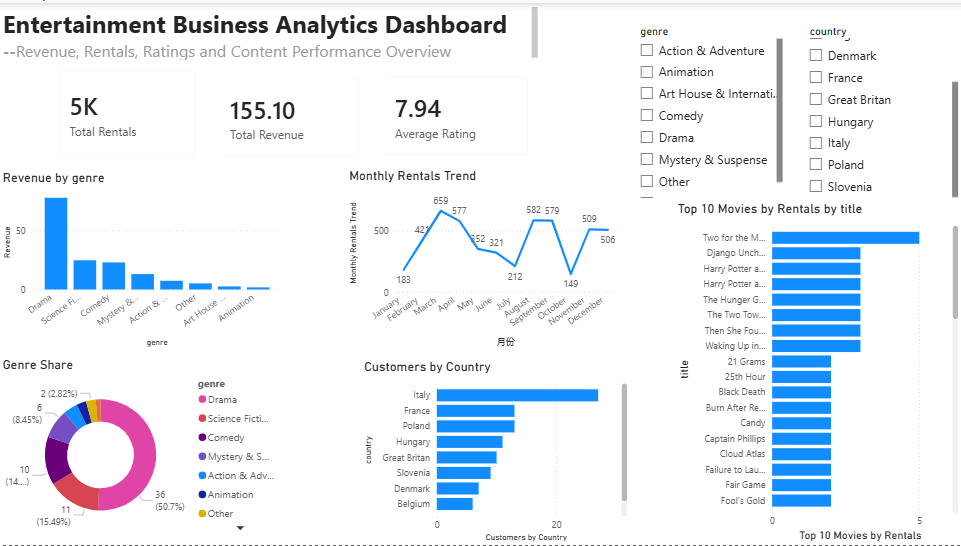
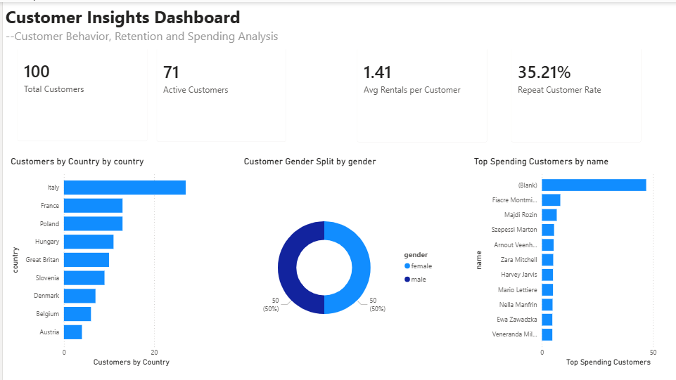
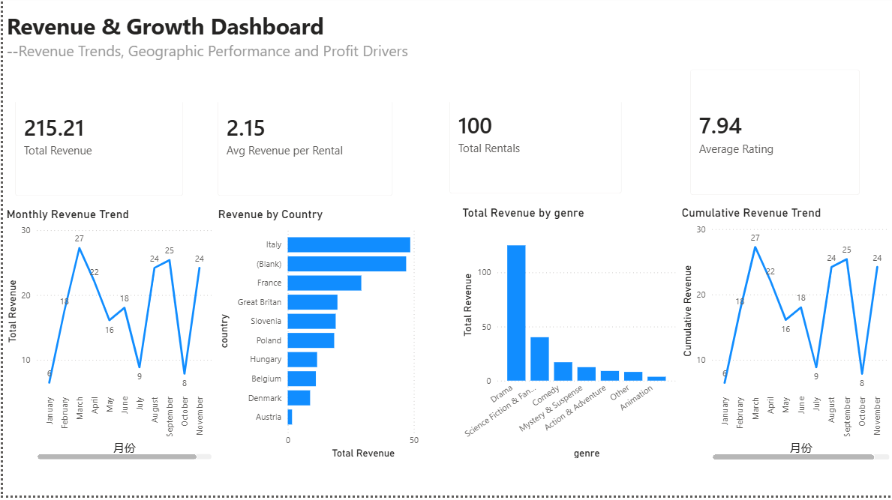
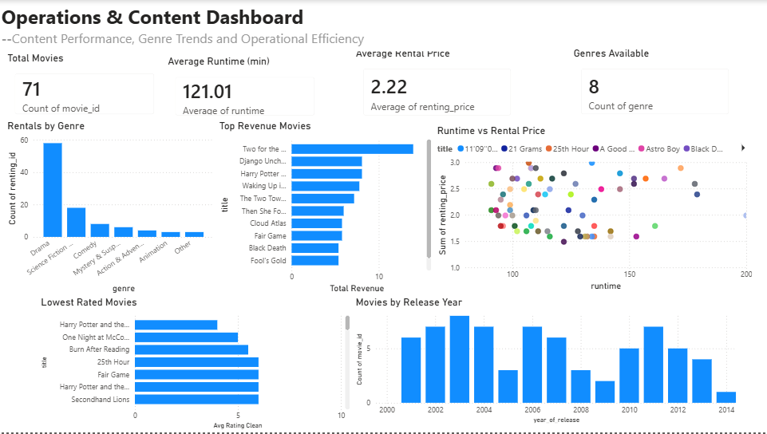
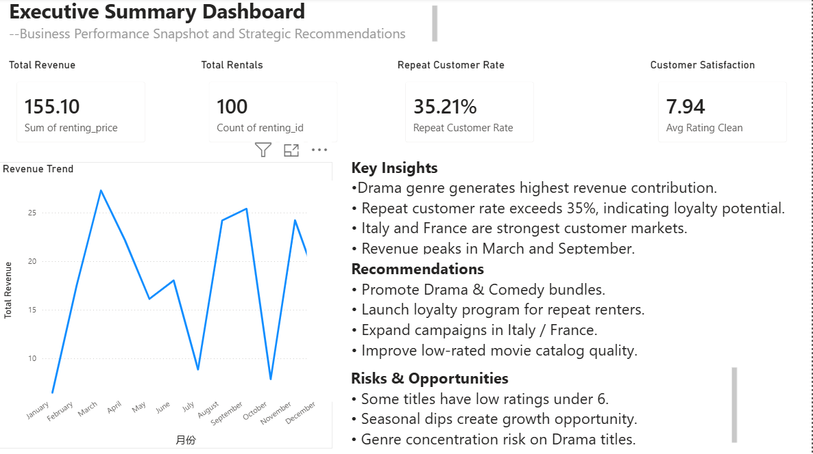
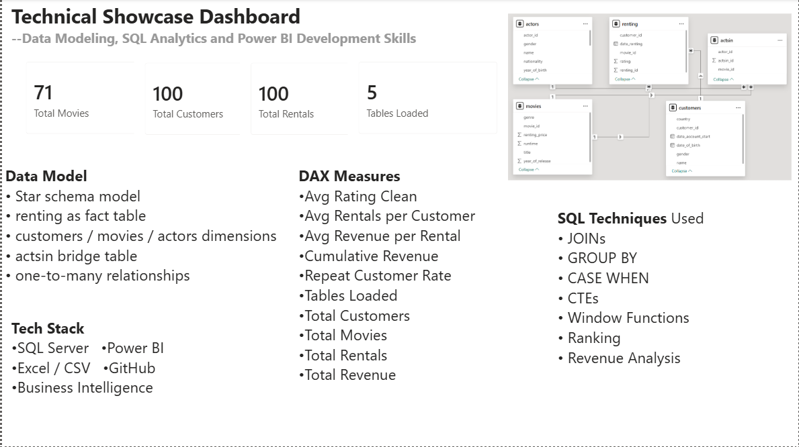

# 🎬 End-to-End Entertainment Business Analytics Project

## 📌 Project Overview

This end-to-end portfolio project analyzes customer rental behavior, movie performance, revenue trends, and operational KPIs using SQL Server, relational data modeling, and Power BI.

The project transforms multiple raw CSV datasets into a business intelligence solution with interactive dashboards and decision-ready insights.

It demonstrates the complete analytics workflow:

Data Cleaning → SQL Analysis → Data Modeling → KPI Design → Dashboard Development → Executive Reporting

---

## 🛠 Tools & Technologies

- SQL Server
- T-SQL
- Power BI
- Excel / CSV
- GitHub
- Data Modeling
- Business Intelligence

---

## 🗂 Data Model

This project uses a relational schema with five connected tables:

- **customers** → customer demographics and account details  
- **renting** → rental transaction records  
- **movies** → movie catalog, genre, pricing, runtime  
- **actors** → actor profile data  
- **actsin** → bridge table connecting movies and actors  

### Relationship Structure

customers ← renting → movies ← actsin → actors

---

## 📊 Power BI Dashboard Pages

### 1️⃣ Executive Overview Dashboard

High-level business KPIs and content performance.

---

### 2️⃣ Customer Insights Dashboard

Customer behavior, segmentation, repeat rate, and geographic distribution.

---

### 3️⃣ Revenue & Growth Dashboard

Revenue trends, country performance, and growth analysis.

---

### 4️⃣ Operations & Content Dashboard

Movie catalog insights, ratings, pricing, runtime, and release trends.

---

### 5️⃣ Executive Summary Dashboard

Management-ready KPI summary for decision makers.

---

### 6️⃣ Technical Showcase Dashboard

Data model design, SQL capabilities, DAX measures, and technical stack.

---

## 📈 Business Analysis Performed

### Customer Intelligence

- Repeat customer rate
- Customer segmentation
- Avg rentals per customer
- Top spending customers
- Country analysis

### Revenue Analytics

- Total revenue
- Revenue by genre
- Revenue by country
- Monthly trend
- Cumulative revenue

### Content Analytics

- Highest rated movies
- Lowest rated movies
- Top rented movies
- Release year trends
- Runtime vs rental price

### Technical Analytics

- JOINs
- GROUP BY / HAVING
- CASE WHEN
- CTEs
- Window Functions
- Ranking
- Running Totals
- DAX Measures

---

## 📁 Repository Structure

movie-rental-business-analytics/
│── dataset/
│   ├── customers.csv
│   ├── renting.csv
│   ├── movies.csv
│   ├── actors.csv
│   └── actsin.csv
│
│── sql/
│   └── entertainment_business_analysis.sql
│
│── dashboard/
│   ├── dashboard_01_overview.png
│   ├── dashboard_02_customer_insights.png
│   ├── dashboard_03_revenue_growth.png
│   ├── dashboard_04_operations_content.png
│   ├── dashboard_05_executive_summary.png
│   └── dashboard_06_technical_showcase.png
│
│── powerbi/
│   └── entertainment_business_analytics.pbix
│
└── README.md

---

## 🚀 Key Skills Demonstrated

- SQL Analytics
- Data Cleaning
- Relational Modeling
- Power BI Dashboarding
- DAX Measures
- KPI Design
- Storytelling with Data
- Executive Reporting

---

## 👤 Author

**Fengzhe Li**  
Portfolio Project for Data Analyst / Business Intelligence Opportunities
